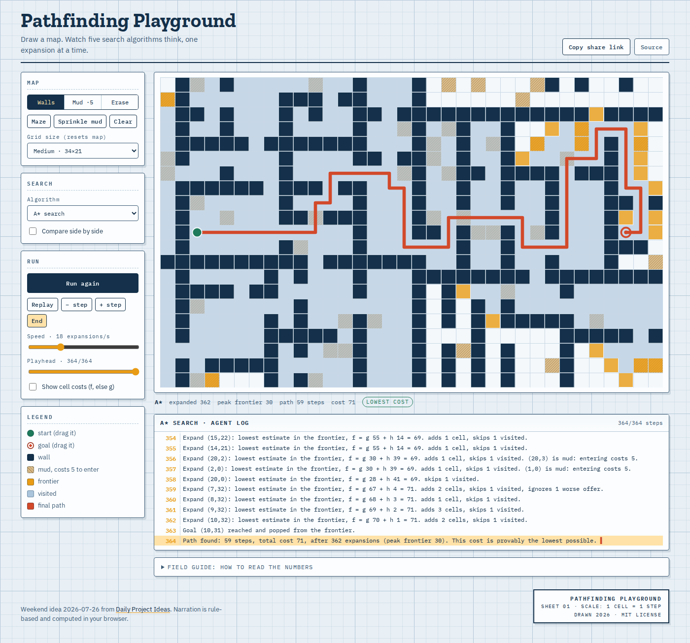
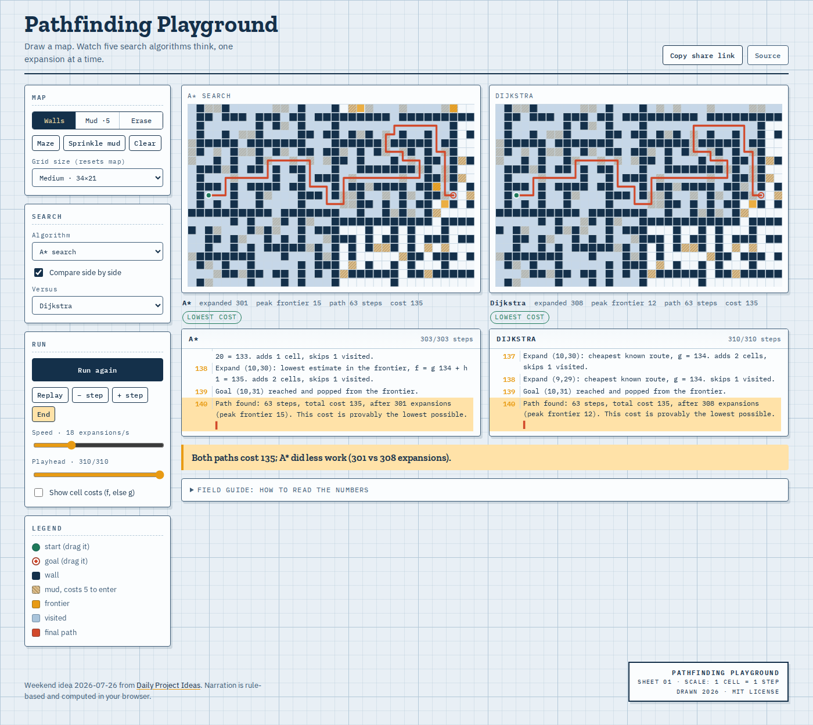

# Pathfinding Playground

Draw a grid map, then watch A*, Dijkstra, BFS, DFS, and Greedy best-first think, one expansion at a time. Every step comes with a narrated explanation derived from the actual algorithm state: which cell got picked, why, and what the numbers were.

**Live:** https://pathfinding-playground-pisanuw.netlify.app



Weekend idea 2026-07-26 from [Daily Project Ideas](https://daily-project-ideas.netlify.app/). The idea suggested Claude API calls for the narration. I skipped that: every line is a template filled with the g, h, and f values the algorithm just computed, so narration is free, instant, deterministic, and works offline. The explanation always matches what the algorithm actually did, which an LLM cannot promise.

## What you can do

- Paint walls and mud (mud costs 5 to enter, everything else costs 1), drag the start and goal pins, generate a maze, sprinkle mud
- Pick one of five algorithms and play the search at 2 to 60 expansions per second, step through it, scrub the playhead, or jump to the end
- Compare two algorithms side by side on the same map, with a one-line verdict at the end ("Both paths cost 135; A* did less work, 301 vs 308 expansions")
- Toggle per-cell cost overlays (f, else g)
- Copy a share link: the whole map, start, goal, and algorithm picks are run-length encoded into the URL hash, so a specific puzzle can be handed to a class as a plain link

The classic demo: sprinkle mud, then compare BFS against Dijkstra. BFS marches straight through (fewest steps), Dijkstra detours around the expensive terrain (lowest cost). Then swap in A* and watch the visited wash shrink.



## Algorithms

| Algorithm | Frontier order | Guarantee |
|---|---|---|
| Breadth-first search | queue age | fewest steps |
| Depth-first search | stack depth | none |
| Dijkstra | cheapest g | lowest cost |
| Greedy best-first | lowest h | none |
| A* | lowest f = g + h | lowest cost |

Heuristic is Manhattan distance, admissible on this grid since the cheapest step costs 1. Neighbor order is deterministic (up, right, down, left), ties break first-in, so the same map always produces the identical trace. There is a test for that.

## Implementation notes

React + Vite, no backend, no other runtime dependencies. Each algorithm is a generator emitting a uniform event trace (`start`, `expand`, `goal`, `done`); the canvas renderer and the narrator both consume the same events, so what you see and what you read cannot drift apart. Scrubbing replays the trace from the top, which sounds wasteful and is fine: traces are bounded by cell count.

Maze generation is recursive division with a guard so a new wall never seals the gap of an earlier one, plus a random chance to leave small chambers as open rooms. Twenty seeded mazes are tested for solvability.

```
npm install
npm run dev       # local dev server
npm test          # 20 vitest cases: optimality, path validity, share round trips, maze solvability, determinism
npm run build     # static bundle in dist/
```

## License

MIT.
