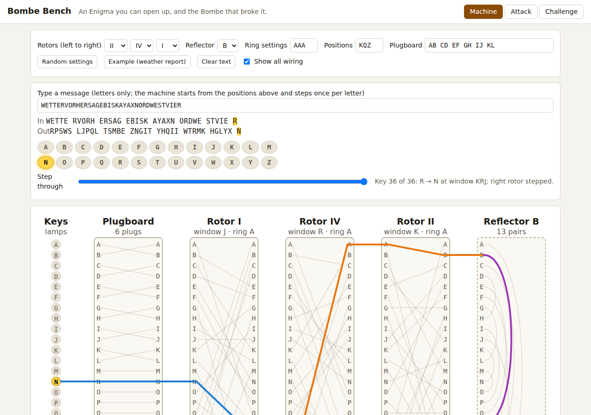

# Bombe Bench

**An Enigma you can open up, and the Bombe that broke it.** Bombe Bench
pairs an accurate Wehrmacht Enigma I (rotors I to V, reflectors A/B/C,
ring settings, plugboard, double stepping) with the Turing-Welchman Bombe
attack. Each keypress lights the signal's path through plugboard, three
rotors and reflector and back; the attack side slides a crib along the
ciphertext, builds the menu graph, finds its loops, and runs a simulated
Bombe over every rotor order and position in a Web Worker, showing how many
hypotheses each position kills until only the stops are left. Instructors
generate challenge messages with hidden settings and share them as links.
Everything runs in the browser.

Live: [bombe-bench.netlify.app](https://bombe-bench.netlify.app)

Implements idea #2 ("Bombe Bench") from the
[2026-10-03 ideas day](https://github.com/pisanuw/daily-project-ideas)
of `pisanuw/daily-project-ideas`.



## What it does

- **Machine tab.** Choose three of rotors I-V, a reflector, ring settings,
  window positions and up to thirteen plug pairs. Type a message and the
  lampboard lights the output letter; a slider steps back through every
  keypress. The wiring view draws all six components with their 26
  contacts, the complete wiring faintly, and the traced path of the
  current keypress in orange (outbound) and blue (return). It also
  reports which rotors moved, naming the double step when it happens, and
  shows the cycle decomposition of each rotor at its current offset and
  of the whole rotor stack (always 13 transpositions, which is why no
  letter ever enciphers to itself).
- **Crib sliding.** Enter ciphertext and a crib; every offset where a
  letter would encipher to itself is marked impossible, with the clashing
  columns in red and the possible offsets listed as chips.
- **Menu graph.** Letters on a circle, one edge per crib position. The
  cycle rank gives the number of independent loops; a fundamental cycle
  basis is drawn in colour and listed with its positions. Clicking a letter
  makes it the test register.
- **The Bombe.** For each rotor order (up to 60) and each of the 17,576
  core positions, the 26 hypotheses "test letter plugged to X" are tested.
  Loops through the test letter are checked first as a fixed-point test of
  the composed scramblers (Turing's original idea); the survivors are then
  propagated through the whole menu with Welchman's diagonal board. A
  position where every hypothesis contradicts itself is rejected. The
  run streams progress from a Web Worker (positions tested, rejected, stops
  so far) and finishes in about a second for all 60 rotor orders. Each
  stop lists the implied plugs, how many crib letters they reproduce, and a
  **checking machine** verdict: no letter plugged twice and every other
  component of the menu still consistent. A stop can be wound back to the
  message start, decrypted, and loaded into the Machine tab.
- **Hypothesis tracer.** For any rotor order and position, follow the
  implications of one hypothesis step by step until the test register is
  lit twice, or try all 26. Turn the diagonal board off to see why loops
  were essential before Welchman's addition. A "random wrong position"
  button shows how quickly a false setting collapses.
- **Challenges.** Pick a message from a bank of stereotyped WWII traffic
  (weather reports, "keine besonderen Ereignisse", convoy sightings),
  choose the number of plug pairs, whether ring settings are random
  (hard) and whether the crib position is given, and get a link. The
  student sees the intercept and crib, opens it in the Attack tab, pastes
  a decryption and gets it graded letter by letter; the settings can be
  revealed and loaded into the machine.

## How the attack works

An Enigma at a fixed position is a permutation of the alphabet with no
fixed points (the reflector pairs letters up). With the plugboard S and
the rotor stack at crib position i written P_i, the cipher letter is
S·P_i·S applied to the plaintext letter. The plugboard is the same for
every position, so around a loop in the menu, S cancels out: if the crib
says A→B at position 1, B→C at position 4 and C→A at position 7, then
P_7·P_4·P_1 must map S(A) to itself. That is a test with no unknowns and
it fails for about 25 of 26 plug guesses at a wrong position. The diagonal
board turns the remaining implications ("A is plugged to K" implies "K is
plugged to A") into a flood that lights the whole test register whenever
the position is wrong. Ring settings never enter: they shift where the
turnover happens, which is why the Bombe assumes the middle rotor does not
move during the crib.

## Limitations

- The middle rotor must not step inside the crib; the challenge generator
  guarantees it, real traffic does not, and a crib longer than about
  fifteen letters has a fair chance of straddling a turnover.
- Stops report core positions with the ring settings at A. A message with
  other ring settings decrypts correctly through the crib and drifts after
  the first turnover; adjusting the ring and the position together is left
  to the student.
- The checking machine here is a consistency check on the implied plugs
  and on the other menu components, not a simulation of the historical
  checking machine, and there is no model of the Bombe's drums, relays or
  its mechanical stop.
- Enigma I only: no M4, no Uhr, no rewirable reflector.
- Challenge settings travel inside the link, lightly scrambled; a student
  who decodes the URL can read them.

## Development

```bash
npm ci
npm run dev        # Vite dev server
npm run lint
npm run typecheck
npm run coverage   # vitest with v8 coverage, thresholds 85%
npm run build      # tsc --noEmit && vite build -> dist/
```

55 vitest tests cover the Enigma (textbook vectors including the 1930
instruction-manual message with ring settings, plugboard and UKW-A, the
double step, involution and no-fixed-point properties), crib placement and
menu construction (cycle basis validity), the Bombe (table correctness,
loop prefilter, finding the true setting, checking-machine results,
hypothesis traces with and without the diagonal board) and challenges
(generation without turnover, link round trip, grading, winding back to
the message start). The UI layer (`src/ui`, `src/worker`) is exercised by
hand in the browser.

## Layout

```
src/core/enigma.ts     Enigma I: rotors, reflectors, stepping, signal trace, cycles
src/core/crib.ts       crib placements, menu graph, cycle basis, test letter
src/core/bombe.ts      scrambler tables, propagation with diagonal board, stops, traces
src/core/challenge.ts  message bank, random settings, link encoding, grading
src/worker/            Bombe search in a Web Worker with progress messages
src/ui/                app shell, SVG wiring view, SVG menu graph, styles
test/                  vitest suites
deploy/target.yml      Netlify static deploy (auto-discovered by the workflow)
```

No backend, no environment variables, no AI calls.
