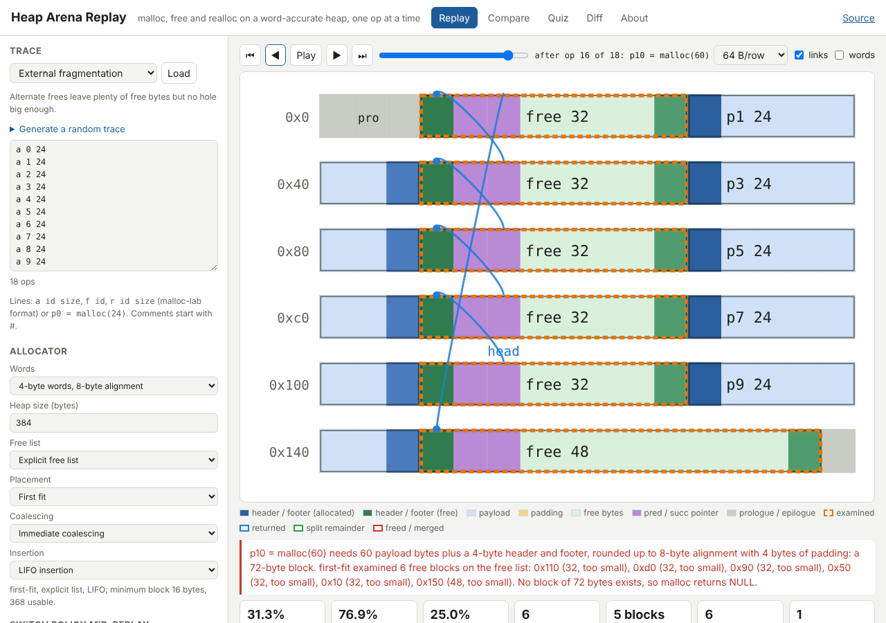

# Heap Arena Replay

**A malloc you can watch.** Heap Arena Replay takes an allocation trace
(`a 0 24`, `f 0`, `r 1 48`, or `p0 = malloc(24)`) and replays it on a
word-accurate simulated heap in the style of the CS:APP allocator: header and
footer boundary tags, a prologue block, an epilogue header, alignment padding,
and for explicit and segregated free lists the pred and succ pointers stored
in the first two payload words of every free block. Each step draws the whole
heap as a strip of words, explains in a sentence what the allocator did and
why, and keeps utilization, fragmentation and search cost over time. The same
trace can be replayed under first-fit, next-fit, best-fit and worst-fit on an
implicit list, an explicit list or segregated size classes, with immediate,
deferred or no coalescing, and the policy can be switched partway through
without disturbing the blocks already placed. A quiz generator reads its
answers off the simulator, exports Markdown or a Canvas QTI package, and a
diff mode finds the first op where a student allocator's addresses leave the
reference. Everything runs in the browser.

Live: [heap-arena-replay.netlify.app](https://heap-arena-replay.netlify.app)

Implements idea #2 ("Heap Arena Replay") from the
[2026-10-06 ideas day](https://github.com/pisanuw/daily-project-ideas)
of `pisanuw/daily-project-ideas`.



## What it does

- **Replay tab.** Pick a preset (textbook walk-through, the four coalescing
  cases, first-fit vs best-fit, the next-fit rover, external fragmentation,
  realloc strategies, size classes) or generate a seeded random trace, then
  step through it with the slider, the arrow keys or Play. The strip shows
  every word: headers and footers (dark), payload (blue), padding (yellow),
  free bytes (green), pred/succ pointers (purple) and the prologue and
  epilogue (grey). The blocks the search examined are outlined in dashed
  orange, the returned block in blue, a split remainder in green and a freed
  or merged block in red; next-fit shows its rover as a marker. Hovering any
  word gives the block's addresses, size, request and padding. The narration
  states the adjusted block size, which blocks the policy examined and
  why it chose the one it did, whether it split, and for a free which of
  the four coalescing cases applied. A chart tracks utilization and external
  and internal fragmentation over the trace (click to seek), and an optional
  word dump lists every word's value and meaning.
- **Policy switch mid-replay.** Choose a new list, fit, coalescing or
  insertion rule and press "Switch before op k": the heap is kept as it is
  and the free lists are rebuilt under the new policy from that op on. Any
  number of switches can be stacked and they travel in share links.
- **Compare tab.** The same trace replayed from scratch under up to eight
  policies, with a table of NULL returns, blocks examined per search, average
  and peak utilization, peak external and average internal fragmentation,
  splits and coalesces; overlaid charts; and a compact strip per policy that
  follows the Replay step.
- **Quiz tab.** Eight question types (which address does the next malloc
  return, how many blocks merge on this free, how big is the carved block, how
  much padding, how many blocks does the search examine, how many free blocks
  remain, how large is the largest, does the malloc succeed). Each question
  shows the trace up to the op in question, checks typed answers, reveals the
  simulator's explanation, and can jump the Replay tab to the heap just
  before that op. Export as Markdown (with or without the key) or as a Canvas
  QTI 1.2 zip of short-answer questions, built in the browser with a
  dependency-free zip writer.
- **Diff tab.** Paste the trace as a student allocator ran it with the
  address each malloc and realloc returned (`a 0 24 -> 0x10`). The reference
  replays the ops under the chosen policy and reports the first op where the
  addresses differ, and separately flags bugs that are wrong under any
  policy: misaligned addresses, blocks outside the heap, overlapping live
  blocks, and NULL where a fit existed. Both heaps are drawn side by side at
  any op. "Download trace with addresses" in the sidebar writes the reference
  output in the same format, which is also a spec for the trace students
  should produce.
- **Share links.** The trace, allocator settings, switches and current step
  pack into the URL fragment.

## Allocator model

- Word size 4 (8-byte alignment) or 8 (16-byte alignment). A request of n
  bytes becomes a block of n + 2 words rounded up to the alignment and at
  least 4 words, so every free block can hold two pointers.
- The heap is a fixed arena of 64 bytes to 64 KB: a padding word, prologue
  header and footer, one free block, and an epilogue header. There is no
  `sbrk`; a request with no fit returns NULL, which is the behaviour the
  fragmentation presets are built around.
- Placement: first, next, best or worst fit. Next-fit keeps a rover on the
  implicit list; on linked lists it behaves as first-fit. Segregated lists use
  eight power-of-two classes starting at the minimum block and search from the
  request's class upward.
- Splitting whenever the remainder is at least the minimum block. Coalescing
  immediately (the standard four cases), never, or deferred until a malloc
  fails, when the whole heap is swept and the search retried.
- Explicit and segregated lists insert LIFO or address-ordered. After a
  policy switch the lists are rebuilt in address order.
- Realloc keeps the block when the new size fits and the spare bytes cannot
  form a block, shrinks in place otherwise, absorbs a free next block when
  that suffices, and only then allocates, copies and frees.
- A consistency checker (`Heap.check()`) walks the heap and the free lists
  and reports misalignment, header/footer mismatches, missed coalescing, list
  cycles, wrong size classes and free blocks missing from the lists; the test
  suite runs it after every op of every preset under all 48 policy
  combinations.

## Trace format

```
512          # malloc-lab header lines (any bare numbers) are ignored
a 0 24       # p0 = malloc(24)
f 0          # free(p0)
r 1 48       # p1 = realloc(p1, 48)
p2 = malloc(16);     # C-style lines work too
a 3 8 -> 0x40        # with the returned address, for diff mode
```

Addresses are byte offsets from the start of the heap. Comments start with
`#` or `//`.

## Running locally

```bash
npm ci
npm run dev        # Vite dev server
npm run lint       # eslint
npm run typecheck  # tsc --noEmit
npm run coverage   # vitest with v8 coverage (thresholds 85%)
npm run build      # tsc + vite build into dist/
```

Node 20 or newer. No runtime dependencies and no environment variables
(`.env.example` is empty on purpose).

## Code layout

```
src/core/heap.ts      word-level heap: boundary tags, free lists, policies, coalescing, realloc, checker
src/core/trace.ts     trace parser (malloc-lab and C-style), presets, seeded generator, replay and summary
src/core/narrate.ts   one-paragraph explanation of a step
src/core/quiz.ts      simulator-verified questions, answer checking, Markdown export
src/core/qti.ts       Canvas QTI 1.2 assessment and manifest
src/core/zip.ts       stored-only zip writer with CRC32 (and a reader for tests)
src/core/diff.ts      student trace vs reference, policy-independent bug checks
src/core/share.ts     URL fragment encoding
src/ui/strip.ts       SVG heap strip and the student range strip
src/ui/chart.ts       SVG line chart with seek
src/ui/app.ts         tabs, sidebar, replay, compare, quiz, diff
test/                 57 vitest cases, 99.1% statement coverage of src/core
```

## Limitations

- The arena is fixed. Real allocators grow the heap, so the malloc-lab
  utilization score (peak payload over heap size) is not reproduced; the
  utilization shown is live payload over the arena.
- Realloc and free do not model payload contents, and allocated blocks always
  carry a footer (no footer-elision optimisation).
- Diff mode trusts the student's addresses and block sizes; it reconstructs
  the student's heap from the addresses alone, so it cannot show their
  headers, footers or free lists.
- The QTI export has been checked structurally against Canvas's exported
  short-answer format, not by importing into a live Canvas instance.

## Idea credit

The idea came from the daily routine's 2026-10-06 ideas day (Show HN
interactive systems explainers and a dev.to post on free, no-login web
tools students actually need). The suggested React, Tailwind and Recharts
stack and optional Supabase were replaced with plain TypeScript, SVG and URL
share links.
