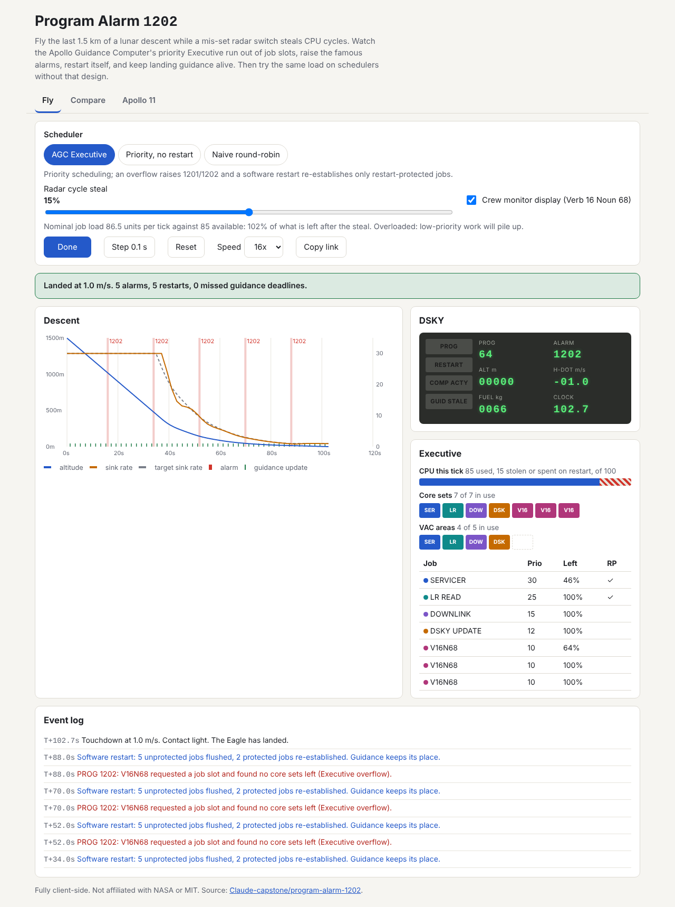

# Program Alarm 1202

A playable model of the Apollo Guidance Computer's priority Executive during
the lunar descent. You fly the last 1.5 km while a mis-set rendezvous radar
switch steals CPU cycles; low-priority jobs pile up holding the Executive's
fixed pools of 7 core sets and 5 VAC areas, a new job request finds nothing
free, and alarm 1202 (or 1201) fires from real resource exhaustion, not a
script. The AGC-style restart then flushes everything, re-establishes only the
restart-protected jobs at their last completed phase, and landing guidance
keeps running. The same load can be replayed on two schedulers without that
design: one that halts on overflow and a naive round-robin one.

Live: [program-alarm-1202.netlify.app](https://program-alarm-1202.netlify.app)

Built as a tribute to Margaret Hamilton, who led the MIT team that wrote the
Apollo on-board flight software.



## What you can do

- **Fly tab**: pick a scheduler, set the radar cycle steal (0 to 30%), toggle
  the crew's Verb 16 Noun 68 monitor display, then play, pause or single-step
  at 1x, 4x or 16x. Live views: a descent chart (altitude, sink rate against
  the target profile, guidance updates and alarm marks), a DSKY-style panel
  (PROG, RESTART, COMP ACTY and GUID STALE lights, alarm code, altitude, sink
  rate, fuel), the CPU split for the current tick, every core set and VAC area
  coloured by the job holding it, the job table with priorities and restart
  protection, and a narrated event log.
- **Compare tab**: the same descent under all three schedulers with outcome,
  1202/1201 counts, restarts, missed guidance deadlines, longest stale-guidance
  gap and display work completed, a guidance timeline per scheduler, and a
  steal sweep from 0% to 30%.
- **Apollo 11 tab**: the real descent timeline with the alarm calls, and a list
  of how the model maps to (and simplifies) the real computer.
- **Share links**: settings and tab live in the URL hash
  (`#s=agc&steal=15&mon=1&tab=fly`).

## The model

One tick is 0.1 s and 100 work units. Five periodic jobs run every 2 s:

| Job | Priority | Work | Pool | Restart protected |
|---|---|---|---|---|
| SERVICER (landing guidance) | 30 | 1100 | core set + VAC | yes, 4 phases |
| LR READ (landing radar) | 25 | 180 | core set + VAC | yes |
| DOWNLINK (telemetry) | 15 | 140 | core set + VAC | no |
| DSKY UPDATE | 12 | 200 | core set + VAC | no |
| V16N68 monitor (optional) | 10 | 110 | core set | no |

That is 86.5% of the CPU with the monitor on and 81% without, close to the
real descent's duty cycle. At 15% steal the monitor tips the load just past
100%: the backlog grows slowly, so the first 1202 arrives about 16 s in, and
the AGC Executive lands with five 1202 restarts and zero missed guidance
deadlines (Apollo 11 had five alarms). The halt-on-overflow Executive aborts at
that first alarm, and round-robin, which gives SERVICER only an equal share,
misses its deadlines and lands hard. At 20% steal without the monitor the
display jobs starve first and the VAC pool runs out before the core sets, so
1201 fires instead.

SERVICER reads the vehicle state when it first gets the CPU and its thrust
command only takes effect when it finishes, so a late pass flies on old data.
The descent is one-dimensional (altitude, sink rate, mass, fuel) with a
30 m/s, then h/15, then 1 m/s target profile; touchdown at 3 m/s or less is a
landing, up to 6 m/s a hard landing, faster a crash.

## Honest limitations

- Job sizes are invented to reproduce the real load level and pool behaviour,
  not measured from the Luminary code, and the real Executive was cooperative
  (jobs yielded at checkpoints) where this one hands the CPU to a higher
  priority job at the next tick.
- The descent is vertical only; there is no attitude, horizontal velocity or
  P64/P66 hand-over beyond the PROG display switching from 63 to 64.
- The model is generous to the AGC design: the protected jobs alone use 64% of
  the CPU, so even at the 30% maximum steal guidance never misses a deadline.
- The Apollo 11 timeline times are approximate to a few seconds.

## Development

```bash
npm install
npm run dev        # http://localhost:5173
npm run lint
npm run typecheck
npm run coverage   # 36 vitest tests, 100% statements on src/core
npm run build      # static site in dist/
```

The simulation core (`src/core`) is pure TypeScript with no DOM access; the UI
(`src/ui`) is vanilla TypeScript with canvas charts and no runtime
dependencies. Deployed to Netlify by the repo's deploy workflow from
`deploy/target.yml`.
