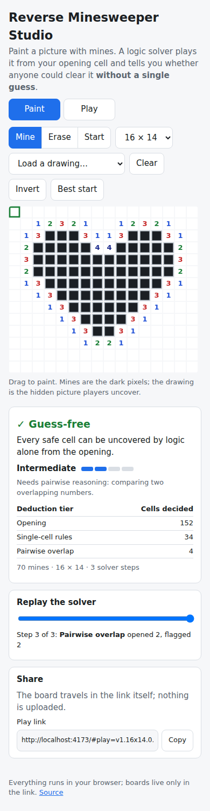

# Reverse Minesweeper Studio

**Draw with mines, and find out whether anyone could clear your picture
without guessing.** Pixel-paint a heart, a name or a logo onto a grid, pick a
safe opening cell, and a client-side constraint solver plays the board from
that opening using only logical deduction. If it gets stuck, the app paints
the trouble spot amber, shows two mine layouts that both fit every visible
number, and searches for the smallest edit that removes the ambiguity. A
guess-free board becomes a share link that friends can play to uncover the
hidden drawing.

Live: [reverse-minesweeper-studio.netlify.app](https://reverse-minesweeper-studio.netlify.app)

Implements idea #1 ("Reverse Minesweeper Studio") from the
[2026-09-29 ideas day](https://github.com/pisanuw/daily-project-ideas)
of `pisanuw/daily-project-ideas`.



## What it does

- **Mine painter.** Drag to paint or erase mines; a Start brush picks the
  opening cell (outlined in green). Boards from 4 × 4 up to 40 × 40, five
  preset drawings, a reproducible random scatter, invert and clear.
  **Best start** tries up to 80 openings (zeros first) in a Web Worker and
  keeps the one that gets the solver furthest.
- **Tiered solver that never guesses.** After every stroke the board is
  re-solved from the opening:
  1. *Single-cell rules*: a satisfied number frees its other neighbors; a
     number with exactly as many hidden neighbors as missing mines flags them.
  2. *Pairwise overlap*: two overlapping numbers bound how many mines the
     overlap holds, which settles the cells only one of them touches (the 1-2
     and subset patterns).
  3. *Frontier search*: every mine layout consistent with the visible numbers
     is enumerated per connected frontier region (backtracking with a node
     budget); a cell that is a mine in all layouts, or in none, is decided.
  4. *Global mine count*: the same layouts filtered by the number of mines
     left, including hidden cells no number touches. This is what clears a
     walled box with nothing inside it.
- **Verdict and difficulty meter.** "Guess-free" or "Needs a guess", with a
  difficulty label from the hardest tier used (Trivial, Beginner logic,
  Intermediate, Expert, Needs mine count) and a table of how many cells each
  tier decided.
- **Where a player would gamble.** Amber cells touch a number but cannot be
  decided; pale cells are sealed off where no number reaches. **Layout A /
  Layout B** overlays two different mine placements for the smallest
  ambiguous region that both agree with every visible number.
- **Smallest fix.** Tries toggling every cell within two of the trouble (in a
  Web Worker), re-solves each, and lists the edits ranked guess-free first,
  then by cells uncovered, then by easier logic. Hover to preview, tap Apply.
- **Solver replay.** A slider steps through the deduction one move at a time,
  tinting the cells each step opened or flagged and naming its tier.
- **Play mode and share links.** The board lives in the URL fragment
  (`#play=v1.16x14.0.<bitmap>`, about 270 characters for 40 × 40), so a link
  is the whole puzzle and nothing is uploaded. Play mode has tap to open,
  long-press or right-click to flag, a Flag-mode toggle for phones,
  chording, a mines-left counter and a reveal of the drawing on a win.

## Design notes

- **Solved means every safe cell is open.** Mines that no number touches
  (the inside of a solid shape) never need to be identified, which is why
  filled drawings are usually easier than outlines.
- **Soundness is enforced, not assumed.** The solver runs against the real
  board and throws if it ever flags a safe cell or opens a mine; a 120-board
  random sweep in the tests exercises that guard.
- **Bounded search.** Frontier enumeration has a 250,000-node budget per
  pass. A region past that is reported ("too large to search exhaustively")
  and treated as undecided rather than hanging the tab.
- The idea suggested React + Tailwind; this build is vanilla TypeScript and
  a single canvas, which keeps a 1,600-cell board responsive while dragging.

## Limitations

- Fix suggestions are single-cell edits near the stuck region. Some boards
  need two coordinated edits; the list then shows the edit that makes the
  most progress, and you apply fixes one at a time.
- "Difficulty" is the hardest deduction tier needed, not a measure of how
  long a human takes; a board needing one pairwise step rates the same as
  one needing fifty.

## Run locally

```bash
npm install
npm run dev        # local dev server
npm run coverage   # 41 vitest cases, ≥85% thresholds enforced
npm run lint && npm run typecheck && npm run build
```

## Architecture

```
src/core/board.ts     grid, neighbors, numbers, resize, readiness checks
src/core/solver.ts    tiered solver, frontier components, enumeration, mine-count filter
src/core/suggest.ts   best opening search and single-edit fix ranking
src/core/game.ts      play-mode rules (flood fill, flags, chording, win/loss)
src/core/share.ts     v1 URL encoding (base64url bitmap) and hash routing
src/core/presets.ts   preset drawings and a seeded random board
src/worker/           Web Worker wrapper for the heavier searches
src/ui/render.ts      canvas drawing and hit-testing
src/main.ts           DOM wiring
```

Deployed on Netlify as a static site via `deploy/target.yml`; no environment
variables, no backend.
