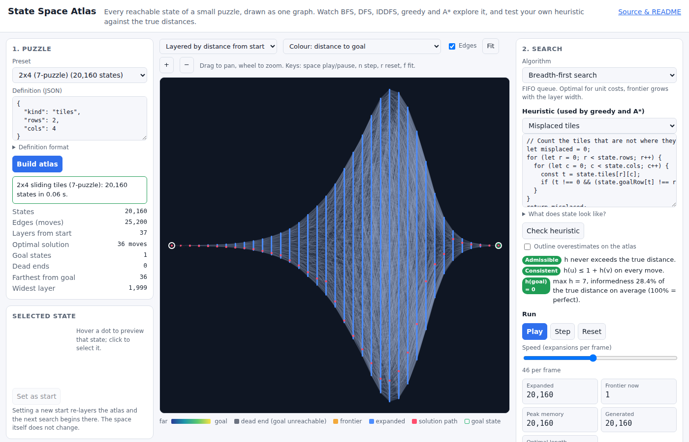

# State Space Atlas

**See the whole space a search algorithm is searching.** State Space Atlas
exhaustively enumerates every reachable state of a small puzzle (Towers of
Hanoi, sliding tiles up to the 8-puzzle, Klotski, Rush Hour), draws the
entire state graph on a canvas, and then lets students watch BFS, DFS,
IDDFS, greedy best-first and A* spread across it with live counters for
expansions, frontier size and peak memory. Because the atlas knows the true
distance from every state to the goal, a student heuristic typed into the
page is checked for admissibility and consistency on every single state, and
the states where it overestimates light up red. Instructors export "beat
this node count" challenges as links. Everything runs in the browser.

Live: [state-space-atlas.netlify.app](https://state-space-atlas.netlify.app)

Implements idea #2 ("State Space Atlas") from the
[2026-10-01 ideas day](https://github.com/pisanuw/daily-project-ideas)
of `pisanuw/daily-project-ideas`.



## What it does

- **Exhaustive enumeration.** A Web Worker runs BFS from the start over the
  implicit move graph until nothing new appears, then a second BFS from
  every goal state gives the exact distance-to-goal of each node. Hanoi
  (3^n states), 2x2 to 3x3 sliding tiles (12 to 181,440 states), the
  classic Huarong Dao Klotski (13,011 states with mirror reduction, 25,955
  without, 116-move optimum) and Rush Hour boards all enumerate in well
  under a second.
- **Canonical hashing and symmetry reduction.** Sliding-block pieces of the
  same size share a letter in the state key, so interchangeable placements
  collapse into one state. When a block puzzle's goal and walls are
  mirror-symmetric, each state and its mirror image become one node.
- **The atlas.** A layered layout puts every state in the column of its
  distance from the start, so the silhouette of the drawing *is* the
  frontier size at each depth and the "exponential frontier" is something
  you can point at. Within a column nodes are ordered by barycentre sweeps
  so edges stay short and dead-end clusters hang off as detached lobes. A
  radial layout is one click away. Colour by distance to goal, distance from
  start, heuristic value, or heuristic error. Pan, zoom, hover any dot for a
  picture of that state, click to inspect it or make it the new start.
- **Five searches, same rules.** BFS, DFS, IDDFS (graph variant, with the
  depth limit and re-expansion count shown), greedy best-first and A*. All
  test the goal at expansion time so their counts compare fairly. Play,
  pause, single-step, or run thousands of expansions per frame; the run
  table keeps every run on the current atlas side by side, with the fewest
  expansions highlighted and optimal paths ticked.
- **Heuristic editor with proof.** Write the body of `(state, puzzle) =>
  number` in plain JavaScript (presets for every puzzle family are readable
  starting points, including one that is inadmissible on purpose and one
  that is admissible but not consistent). *Check heuristic* evaluates it on
  every state and reports admissibility (with the count of overestimating
  states and the worst margin), consistency (edges where h drops by more
  than 1), h(goal) = 0, and informedness (mean h / h*). Overestimating states
  can be outlined on the atlas; the error colour mode paints them red.
- **Challenges.** Export the current puzzle, algorithm and a target as a
  link (`#c=...`, about 220 characters). The student who opens it gets the
  same atlas, writes a heuristic, and the page judges the run: fewer
  expansions than the target, goal reached, right algorithm, heuristic
  admissible.
- **Custom puzzles.** The definition is a small JSON object (shown in the
  editor for every preset): Hanoi with 1 to 8 disks on 3 to 5 pegs, tile
  puzzles up to 9 cells with any solvable start, or a block puzzle drawn as
  rows of letters with a goal position and `free` or `rushhour` movement.

## Design notes

- **Deterministic instead of LLM.** The idea needs no language model and
  uses none: true distances come from BFS, heuristic checks are exact, and
  the challenge verdict is arithmetic.
- **Undirected graph.** Every move in these puzzle families is reversible,
  so one adjacency structure (CSR arrays) serves the forward enumeration,
  the backwards distance-to-goal BFS and the searches. The enumerator caps
  the space at 400,000 states so a typo in a custom definition fails fast
  instead of eating memory.
- **Farthest start.** Tile presets start at the state farthest from the
  goal (31 moves for the 8-puzzle), found by enumerating from the goal
  first; custom starts are checked with the inversion-parity test.
- **Canvas, not WebGL.** 181,440 nodes redraw in a few milliseconds as
  2-pixel squares; edges are drawn once per view into an offscreen bitmap
  and skipped above 150,000 edges unless you zoom in. The idea suggested
  Sigma.js or regl; a single 2D canvas was enough and has no dependencies.
- **IDDFS on a graph.** Textbook tree-search IDDFS never terminates on a
  graph this cyclic, so each round skips a state it already reached at the
  same or a smaller depth. Nodes expanded in earlier rounds still count
  again, which is the cost the algorithm is supposed to show.

## Limitations

- The space is capped at 400,000 states, so the 15-puzzle, 4-disk 5-peg
  Hanoi variants with many disks, and larger block boards are out of reach;
  this is a teaching atlas, not a solver.
- Heuristics run on the main thread in 20,000-state chunks; a slow
  heuristic on the 8-puzzle can take a few seconds to check.
- Layout is layered or radial; there is no force-directed view, so a
  state's horizontal position is its depth and nothing else.

## Run locally

```bash
npm install
npm run dev        # local dev server
npm run coverage   # 65 vitest cases, ≥85% thresholds enforced
npm run lint && npm run typecheck && npm run build
```

## Architecture

```
src/core/puzzle.ts     shared Puzzle contract and definition types
src/core/hanoi.ts      Towers of Hanoi (digit-per-disk keys)
src/core/tiles.ts      sliding tiles (base-36 keys, parity check)
src/core/blocks.ts     Klotski / Rush Hour (shape-letter keys, mirror reduction)
src/core/factory.ts    createPuzzle, parsePuzzleDef
src/core/enumerate.ts  BFS enumeration, CSR graph, true distances, pack/unpack for postMessage
src/core/layout.ts     layered and radial layouts, spatial index for hover
src/core/search.ts     BFS, DFS, IDDFS, greedy, A* as steppable searches
src/core/heuristic.ts  compile/evaluate student code, admissibility and consistency checks, presets
src/core/challenge.ts  challenge links (base64url JSON) and verdicts
src/core/presets.ts    the puzzle catalogue
src/worker/            enumeration Web Worker
src/ui/atlas.ts        canvas renderer (pan, zoom, edge cache, search overlay)
src/ui/preview.ts      mini drawings of a state (tiles, pegs, blocks)
src/ui/app.ts          DOM wiring
```

Deployed on Netlify as a static site via `deploy/target.yml`; no environment
variables, no backend.
